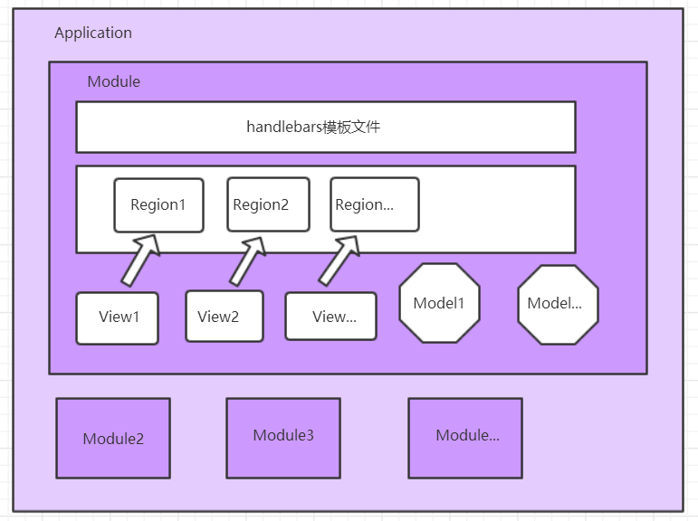
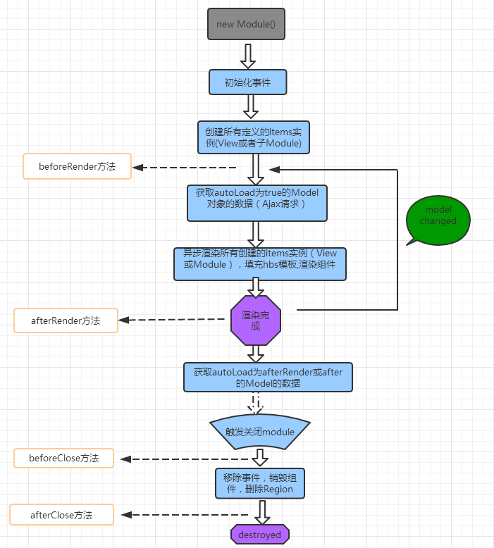

## drizzle 简介
#### 简介  
Drizzlejs是一个功能强大，可以高度扩展的且致力于解决项目前端Javascript代码结构（包括目录结构、文件结构、jQuery插件调用方式等）问题的MVC前端框架，通过对目录结构、目录中文件结构以及文件中的格式的约定来实现项目的规范性、可读性、可维护性。

#### 核心对象
Application、 Module、View、Model、Region、Router

#### 架构图示
Drizzle 中 View和Module、Model的对应关系，可以简单归纳为下图


#### 生命周期
Drizzle 中的生命周期，主要有beforeRender、beforeClose、afterRender、afterClose，简单图示如下：


## drizzle 基本使用
下载drizzlejs [githib链接](https://github.com/jacokoo/drizzlejs)
新建一个 html 文件，引入 dist/drizzle.js
调用 Drizzle.Application 实例化一个 drizle
提供容器（挂载点）container和getResource方法
调用实例的 start 方法
浏览器打开html，一个hello world就完成了

```html
    <!DOCTYPE html>
    <html>
        <head>
            <meta charset="utf-8"/>
            <title>Hello DrizzleJs</title>
        </head>
        <body>
            <div id="content"></div>
            <script src="./dist/drizzle.js"></script>
            <script>
                var app = new Drizzle.Application({
                    container: document.getElementById('content'),
                    getResource (path) {
                        return function () { 
                            return 'hello world'
                        }
                    }
                })
                app.start()
            </script>
        </body>
    </html>
```
## 使用 handlebars
在刚才的html中引入handlebars.js，就可以使用 handlebars的模板语法，此处只做简单的样例
Handlebars的语法使用，参见 Handlebars 中文网
[Handlebars 中文网](https://www.handlebarsjs.cn/guide/)

````html
<!DOCTYPE html>
<html>
    <head>
        <meta charset="utf-8"/>
        <title>Hello DrizzleJs</title>
    </head>
    <body>
        <div id="content"></div>
        <script src="./dist/drizzle.js"></script>
        <script src="https://cdn.jsdelivr.net/npm/handlebars@latest/dist/handlebars.js"></script>
        <script>
            var D = window.Drizzle;
            var template = Handlebars.compile;
            const app = new D.Application({
                container: document.getElementById('content'),
                getResource (path) {
                    return template('<div>hello world</div>')
                }
            });
            window.app = app
            app.start()

        </script>
    </body>
</html>
````
## server demo
## 使用 sleet 模板
#### sleet
Sleetjs 是一种把代码编译成 HTML/XML 的语言。Sleet 是严格基于缩进的语言. 缩进相等的相邻标记为兄弟标记，缩进大的的标记是缩进小的标记的子孙标记.
一个缩进可以是任意多个空格或者一个tab符, 唯一的规则是, 你的所有缩进都要跟你一个缩进一样.
例如你的第一个缩进是4个空格, 那接下来所有的缩进都应该是4个空格或者它的倍数, 否则会编译错误.
Sleet文件后缀名为.sleet,默认编译成html后缀的文件。  
安装：
> npm install -g sleet

[具体详情参考](https://github.com/JacoKoo/sleetjs/blob/master/README.cn.md)
#### sleet-handlebars
Sleet-Handlebars 是 Sleet 的一个扩展，用于把 Sleet 代码编译成 Handlebars 模板  
安装：
> npm install –g  sleet-handlebars

打开命令行执行sleet b-temp.sleet，sleet文件最后编译成b-temp.hbs并存放在同一个路径下  
见如下示例：  

b-temp.sleet
````sh
#!handlebars

module
    div.todoapp
        div(data-region='header')
        div(data-region='main')
        div(data-region='footer')

view('header')
    h1 todos

view('main')
    ul.todo-list > each(todos)
        li(class='completed')&if(completed)
            input.toggle(type='checkbox' id='toggle-' + id data-name='id' data-value=id)(checked='true')&if(completed)
            label(id='edit-' + id) > echo(text)
            button.destroy(id='destroy-' + id)(data-name='id' data-value=id)

view('footer')
    button#remove.clear-completed(class='hidden')&unless(info.haveCompleted) Clear completed
````
b-temp.hbs
````html
{{#module}}
    <div class="todoapp">
        <div data-region="header"></div>
        <div data-region="main"></div>
        <div data-region="footer"></div>
    </div>
{{/module}}
{{#view "header"}}
    <h1>todos</h1>
{{/view}}
{{#view "main"}}
    <ul class="todo-list">{{#each todos}}
        <li {{#if completed}} class="completed"{{/if}}>
            <input class="toggle" {{#if completed}} checked{{/if}} type="checkbox" id="toggle-{{id}}" data-name="id" data-value="{{id}}"/>
            <label id="edit-{{id}}">{{text}}</label>
            <button class="destroy" id="destroy-{{id}}" data-name="id" data-value="{{id}}"></button>
        </li>
    {{/each}}</ul>
{{/view}}
{{#view "footer"}}
    <button id="remove" class="clear-completed" {{#unless info.haveCompleted}} class="hidden"{{/unless}}>Clear completed</button>
{{/view}}
````

