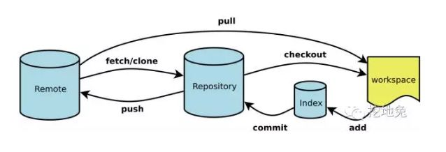

# 提交规范

关于git的一些基础概念：
- Workspace：工作区
- Index / Stage：暂存区
- Repository：仓库区（或本地仓库）
- Remote：远程仓库

他们之间的关系图：




## 代码同步

在多人合作开发中，有事没事经常拉取代码，及时同步合作伙伴的代码到自己的分支，是一个良好的习惯。但并非所有程序员都有这种习惯，同步代码的频率太低，或者时间间隔太久，有时候会给我们的工作带来麻烦，甚至是灾难性的。在多人共用一个分支开发等不规范的开发模式中，不喜欢同步代码这种习惯的缺陷体现的更为显著。

即使是在个人分支独立开发，太久不同步代码，也会极大增加代码合并的冲突比例，增加处理冲突的麻烦，影响工作效率。同时，处理冲突也会增加本来不必要的git提交记录，影响整洁性。正常情况下，如果是多人合作开发一个版本，建议最少每天同步一次代码。

## 解决冲突

在多人合作开发中，当从个人分支（如 allen-res分支）请求合并到 release 分支时，一定要**保证 release 分支远端的最新提交已经同步到个人分支（allen-res）**。在代码没有冲突的时候，这一步显得似乎没有那么重要，但是公有**受保护的 release 分支有版本高于个人分支的提交，始终是一个隐患**。

冲突应在个人分支解决好，再请求合并到公有分支，不要在有冲突的情况在共有分支直接执行 merge 个人分支，再共有分支处理冲突的操作。本地修改较多时，在同步代码前，建议先执行git stash save 操作将代码暂存，合并完成后，再见代码pop，然后再处理冲突。

## 本地提交

遇到过不少有这种习惯的开发人员: 改动代码之后，随手commit，但是不推送，本地经常累积多个未推送的commit（有些甚至是几天前的commit）。这种习惯的好处是，能够及时准确地记录细粒度的改动意图，但代价也是较大的。本地累积多个未推送的commit，使得代码拉取、合并、解决冲突、切换分支等操作都显得极为不方便。

个人更倾向于，有代码提交意愿时，再进行commit，这种策略往往是 pull -> merge -> commit -> push 连贯操作，在解决冲突等方面，不会出现什么大问题，在没有push意愿之前，即使本地有较多修改，也不影响我进行各类操作。这个习惯的不之处在于，当修改的代码过久，等到commit时，对当时改动的意图有些模糊，且当一个文件有多出不同目的的改动时，不易拆分描述。

关于提交的注释，建议遵顼下面的原则：
> - 所有提交，应该尽量言简意赅描述提交的内容和影响、风险等
> - 所有提交，建议遵循 GIT-CZ 规范注释
> - 修复缺陷，如果有bug单号，带上bug单号
> - 功能开发，如果有任务单号，建议带上任务单号
> - 代码优化，如果有优化单号，建议带上优化单号
> - 处理冲突，尽量包含一些处理冲突的信息

## 代码检查

所有项目工程都**推荐配置pre-commit钩子**，在 commit 时触发代码格式和规范审查并部分修复，如果不触发pre-commit，关于ESLint等一些格式类的问题，只能依靠个人的自觉性处理。但经验表明人的自觉性时靠不住的，如果不统一规则，并且启用工具检查，我们每次更新代码，大概率会看到控制台报出一堆红色的警告，影响心情。

## 推送远端

在个人分支开发时，建议每次commit之后随手push，每天下班前提交当前的改动。这样的好处是：
- 将劳动成果及时备份，减少本地丢弃回滚之类的操作导致的代码丢失风险
- 能够多端同步，工作无缝连接，当你在会议室使用笔记本，或者在家办公时，都可以通过拉取代码，接着开发

如果是多人共用一个分支等比较尴尬的开发模式，则代码的push应当谨慎考虑代码的完整度、风险、影响范围等

## 合并请求

如果你是大团队合作开发的管理员，每天面对数十个合并请求是一件比较痛苦的事情，但很多时候这是一种常态。有时候还要讲究合并顺序，先合A再合B和先合B再合A的麻烦程度可能大相径庭，
也总有一些冲突在某些在审的合并请求中产生，需要管理员手动修改部分代码。

针对这些情况，规范开发、严格检查、及时更新同步代码等能有效降低管理员的痛苦程度。

## git常用命令

整理了一些常用的git命令，记熟业务中经常用到的，能大大减少对搜索引擎的依赖。

#### Git 配置

```py
	# 显示配置列表
	$ git config --list

	# 编辑 Git 配置文件
	$ git config -e [--global]

	# 设置提交代码时的用户信息
	$ git config [--global] user.name "[name]"
	$ git config [--global] user.email "[email address]"
```

#### 文件操作

```py
	# 添加指定文件到暂存区
	$ git add [file1] [file2] ...

	# 添加指定目录到暂存区，包括子目录
	$ git add [dir]

	# 添加当前目录的所有文件到暂存区
	$ git add .

	# 删除工作区文件，并且将这次删除放入暂存区
	$ git rm [file1] [file2] ...

	# 停止追踪指定文件，但该文件会保留在工作区
	$ git rm --cached [file]

	# 改名文件，并且将这个改名放入暂存区
	$ git mv [file-original] [file-renamed]
```
#### 代码提交

```py
	# 提交暂存区到仓库区
	$ git commit -m [message]

	# 提交暂存区的指定文件到仓库区
	$ git commit [file1] [file2] ... -m [message]

	# 提交工作区自上次 commit 之后的变化，直接到仓库区
	$ git commit -a

	# 提交时显示所有 diff 信息
	$ git commit -v

	# 使用一次新的 commit，替代上一次提交
	# 如果代码没有任何新变化，则用来改写上一次 commit 的提交信息
	$ git commit --amend -m [message]

	# 重做上一次 commit，并包括指定文件的新变化
	$ git commit --amend   ...
```

#### 分支相关

```py
	# 列出所有本地分支
	$ git branch

	# 列出所有远程分支
	$ git branch -r

	# 列出所有本地分支和远程分支
	$ git branch -a

	# 新建一个分支，但依然停留在当前分支
	$ git branch [branch-name]

	# 新建一个分支，并切换到该分支
	$ git checkout -b [branch]

	# 新建一个分支，指向指定 commit
	$ git branch [branch] [commit]

	# 新建一个分支，与指定的远程分支建立追踪关系
	$ git branch --track [branch] [remote-branch]

	# 切换到指定分支，并更新工作区
	$ git checkout [branch-name]

	# 建立追踪关系，在现有分支与指定的远程分支之间
	$ git branch --set-upstream [branch] [remote-branch]

	# 合并指定分支到当前分支
	$ git merge [branch]

	# 选择一个 commit，合并进当前分支
	$ git cherry-pick [commit]

	# 删除分支
	$ git branch -d [branch-name]

	# 删除远程分支
	$ git push origin --delete 
	$ git branch -dr
```

#### tag管理

```py
	# 列出所有 tag
	$ git tag

	# 新建一个 tag 在当前 commit
	$ git tag [tag]

	# 新建一个 tag 在指定 commit
	$ git tag [tag] [commit]

	# 查看 tag 信息
	$ git show [tag]

	# 提交指定 tag
	$ git push [remote] [tag]

	# 提交所有 tag
	$ git push [remote] --tags

	# 新建一个分支，指向某个 tag
	$ git checkout -b [branch] [tag]

```

#### 状态和历史追踪

```py
	# 显示有变更的文件
	$ git status

	# 显示当前分支的版本历史
	$ git log

	# 显示 commit 历史，以及每次 commit 发生变更的文件
	$ git log --stat

	# 显示某个文件的版本历史，包括文件改名
	$ git log --follow [file]
	$ git whatchanged [file]

	# 显示指定文件相关的每一次 diff
	$ git log -p [file]

	# 显示指定文件是什么人在什么时间修改过
	$ git blame [file]
```

#### diff对比

```py
	# 显示暂存区和工作区的差异
	$ git diff

	# 显示暂存区和上一个 commit 的差异
	$ git diff --cached []

	# 显示工作区与当前分支最新 commit 之间的差异
	$ git diff HEAD

	# 显示两次提交之间的差异
	$ git diff [first-branch]...[second-branch]

	# 显示某次提交的元数据和内容变化
	$ git show [commit]

	# 显示某次提交发生变化的文件
	$ git show --name-only [commit]

	# 显示某次提交时，某个文件的内容
	$ git show [commit]:[filename]

	# 显示当前分支的最近几次提交
	$ git reflog

```
#### 同步与推送

```py
	# 下载远程仓库的所有变动
	$ git fetch [remote]

	# 显示所有远程仓库
	$ git remote -v

	# 显示某个远程仓库的信息
	$ git remote show [remote]

	# 增加一个新的远程仓库，并命名
	$ git remote add [shortname] [url]

	# 取回远程仓库的变化，并与本地分支合并
	$ git pull [remote] [branch]

	# 上传本地指定分支到远程仓库
	$ git push [remote] [branch]

	# 强行推送当前分支到远程仓库，即使有冲突
	$ git push [remote] --force

	# 推送所有分支到远程仓库
	$ git push [remote] --all

```
#### 重置或回滚

```py
	# 恢复暂存区的指定文件到工作区
	$ git checkout [file]

	# 恢复某个 commit 的指定文件到工作区
	$ git checkout [commit] [file]

	# 恢复上一个 commit 的所有文件到工作区
	$ git checkout .

	# 重置暂存区的指定文件，与上一次 commit 保持一致，但工作区不变
	$ git reset [file]

	# 重置暂存区与工作区，与上一次 commit 保持一致
	$ git reset --hard

	# 重置当前分支的指针为指定 commit，同时重置暂存区，但工作区不变
	$ git reset [commit]

	# 重置当前分支的 HEAD 为指定 commit，同时重置暂存区和工作区，与指定 commit 一致
	$ git reset --hard [commit]

	# 重置当前 HEAD 为指定 commit，但保持暂存区和工作区不变
	$ git reset --keep [commit]

	# 新建一个 commit，用来撤销指定 commit
	# 后者的所有变化都将被前者抵消，并且应用到当前分支
	$ git revert [commit]

```


