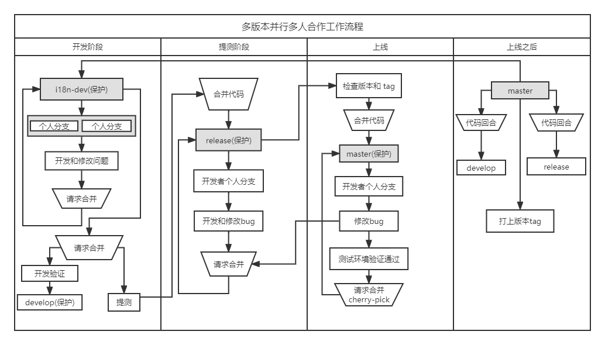
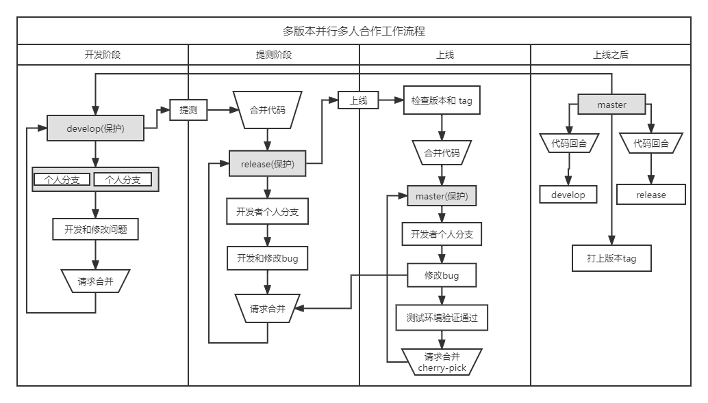

# 工作流策略

在团队合作中，关于分支设置、工作流程等策略会直接影响团队效率和稳定性，目前常见的分支策略有以下三种：GitFlow、GitHubFlow以及GitLabFlow。

## GitFlow

GitFlow通常包含五种类型的分支：Master分支、Develop分支、Feature分支、Release分支以及Hotfix分支。

- Master分支：主干分支，也是正式发布版本的分支，其包含可以部署到生产环境中的代码，通常情况下只允许其他分支将代码合入，不允许向Master分支直接提交代码（对应生产环境）。
- Develop分支：开发分支，用来集成测试最新合入的开发成果，包含要发布到下一个Release的代码（对应开发环境）。
- Feature分支：特性分支，通常从Develop分支拉出，每个新特性的开发对应一个特性分支，用于开发人员提交代码并进行自测。自测完成后，会将Feature分支的代码合并至Develop分支，进入下一个Release。
- Release分支：发布分支，发布新版本时，基于Develop分支创建，发布完成后，合并到Master和Develop分支（对应集成测试环境）。
- Hot fix分支：热修复分支，生产环境发现新Bug时创建的临时分支，问题验证通过后，合并到Master和Develop分支。

## GitHubFlow

GitHubFlow通常只有一个Master分支是固定的，而且GitHubFlow中的Master分支通常是受保护的，只有特定权限的人才可以向Master分支合入代码。

在GitHubFlow中，新功能开发或修复Bug需要从Master分支拉取一个新分支，在这个新分支上进行代码提交；功能开发完成，开发者创建Pull Request（简称PR），通知源仓库开发者进行代码修改review，确认无误后，将由源仓库开发人员将代码合入Master分支。

很多人可能会问，提交代码通常是commit或者push，拉取代码才是pull，为什么GitHubFlow中提交代码提出的是“Pull Request”。因为在GitHubFlow中，PR是通知其他人员到你的代码库去拉取代码至本地，然后由他们进行最终的提交，所以用“pull”而非“push”。

GitHubFlow优点是相对于GitFlow来说比较简单，其缺点是因为只有一条Master分支，万一代码合入后，由于某些因素Master分支不能立刻发布，就会导致最终发布的版本和计划不同。

## GitLabFlow

相比于GitHubFlow，GitLabFlow增加了对预生产环境和生产环境的管理，即Master分支对应为开发环境的分支，预生产和生产环境由其他分支（如Pre-Production、Production）进行管理。在这种情况下，Master分支是Pre-Production分支的上游，Pre-Production是Production分支的上游；GitLabFlow规定代码必须从上游向下游发展，即新功能或修复Bug时，特性分支的代码测试无误后，必须先合入Master分支，然后才能由Master分支向Pre-Production环境合入，最后由Pre-Production合入到Production。

GitLabFlow中的Merge Request是将一个分支合入到另一个分支的请求，通过Merge Request可以对比合入分支和被合入分支的差异，也可以做代码的Review。

## 大团队多版本并行

在现实的大型团队开发中，很难严格说是属于哪一种工作流策略，可能比上面的都要复杂一些，常常是两种或多种策略的混合。下面的流程简图，体现的是国际化版本功能开发的完整流程，像这样的版本可能有多个并行，也就是同时存在多个（i18n-dev）这样的受保护分支，它们的流程基本一样。但它们之间的混合、解耦、依赖、顺序关系没有画出来，还有它们 Hotfix 热修复分支的同步关系， 这些细节才是需要关注的重点。

#### 多版本流程简图

## 小团队流水线迭代

小团队流水线迭代，不用考虑多版本之间的混合、解耦、依赖、顺序关系，除此之外，流程基本与上图相似。只需要维护固定个受保护的分支就可以了，这个比较适合上面介绍的 GitFlow 策略模式。

#### 单版本迭代流程简图

## 我们的策略

待定！