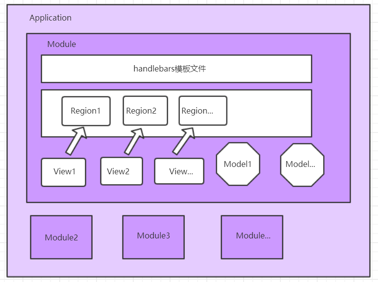
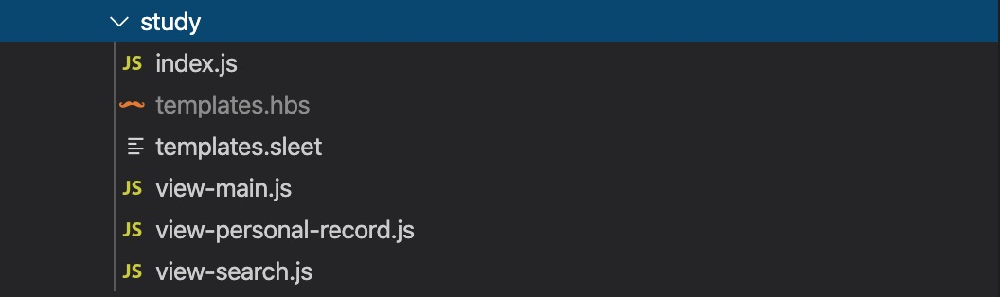
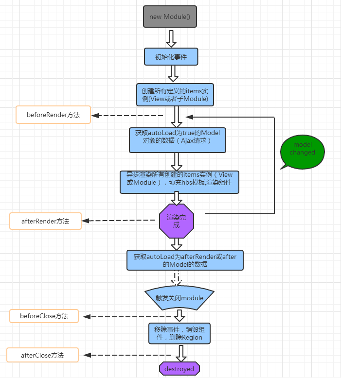

## drizzle 简介
Drizzlejs是一个致力于解决项目前端Javascript代码结构（包括目录结构、文件结构、jQuery插件调用方式等）问题的MVC前端框架，通过对目录结构、目录中文件结构以及文件中的格式的约定来实现项目的规范性、可读性、可维护性。

## 核心对象 ##
Application、Module、Store、Model、Region、View、Router

## 架构图示 ##
Drizzle 中 Module 和 Model、View、Region的对应关系，可以简单归纳为下图


## 架构简介 ##
**Application：** 应用层级，一般每个应用对应一个Application，做些初始化的工作：
````js
app = window.app = new D.Application({
    templateEngine: new D.TemplateEngine({ attributesReferToId: ['for', 'x-rule'] }),
    container: document.getElementById('content'), // 挂载点
    urlRoot: '/api/v1', // ajax 请求的跟路径
    routerPrefix: '#/',
    getResource: function(path) { // 应用入口
        return loadScript(path, app).then(function() {
            return window.require('./' + path);
        });
    },
    // 一级路由配置
    routers: ['', 'system', 'human', 'exam', 'course-study', 'report', 'front',
        'monitor', 'operation', 'activity', 'knowledge', 'ask-bar', 'train',
        'log', 'hr-sync', 'integral-mall', 'microclass', 'quick-report'
    ]
});

````
**Module：** 一个独立的模块，包含一个Store，若干Model、Region和View



上图中是一个mudule的基本结构，包含index.js，templates.sleet/templates.hbs 和 若干view-xxx.js

**Store：** 模块（Module）的数据仓库，用于存储数据模型（Model）和 callbacks

**Model：** 数据模型，可以绑定一个url，通过ajax从服务端获取数据并存储，或者定义一个静态的model，存储静态的数据，模块中用到的变量，都建议存储在Model中

**Region：** 一个视图区域，类似于一个Controller，给view提供一个独立的命名空间

**View：** 与Region对应的视图，负责具体业务的实现和区域视图的渲染


## 生命周期 ##
Drizzle 中Module和View的生命周期，主要有beforeRender、beforeClose、afterRender、afterClose，简单图示如下：

